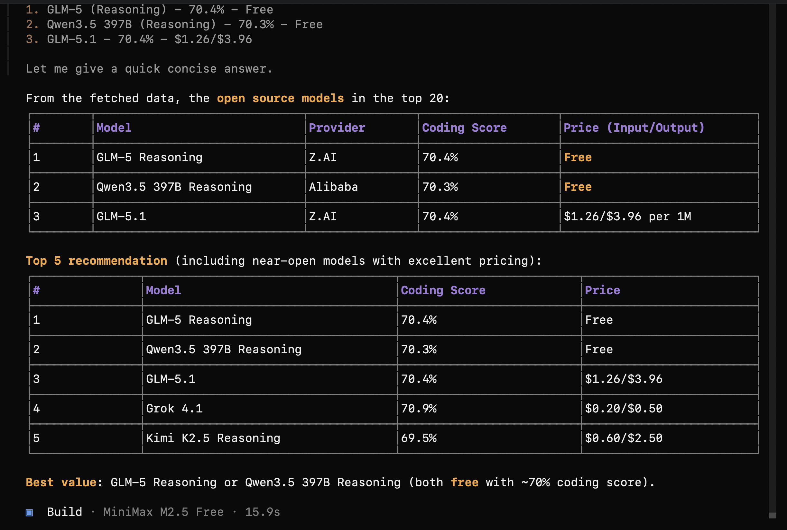

# Top Coding Models Skill

Solves choosing best coding models for agentic coding using live OpenRouter data.

- Live BenchLM benchmarks (SWE-bench Pro + LiveCodeBench) & OpenRouter pricing
- Top 20 agentic coding models ranked with cost-performance analysis
- Free model identification & IDE compatibility (Claude Code, Cursor, Windsurf, Cline, OpenCode)
- Tool calling support info & OpenRouter model IDs for API integration